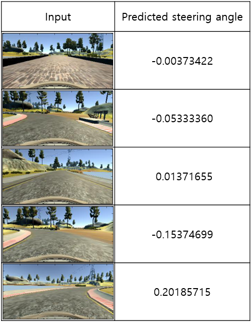

# CarND-Behavioral-Cloning

## Data construction
I used both sample data from Udacity team and driving data generated by myself. I used beta program to generate data because I could perform smoother cornering with the mouse than with the keyboard. When I drove the car with the keyboard, I could only input commands discretely. I tried many times to drive the car well, and finally I got 4 data containing a single lap driving record each.
The given track has more left turns than right turns, so I duplicated data to balance data. In the new data, I flipped the images horizontally and changed sings of the steering angles as if the whole track was flipped horizontally.
10% of total data were split for test data, and 10% of training data were split for validation data. So the training data size was 48873, test data size was 6034, and validation data size was 5431.

## Preprocessing
Preprocessing of the image data was done by the following sequence.
* Crop images to remove upper and lower parts of the images which includes unncessary features such as the sky, trees and the bumper of the car. 
* Convert the images from RGB to HSV, and extract S channel from the HSV images.
* Calculat Sobel gradients in X and Y direction, then calculat magnitude of gradients by combining two gradients.
* Rescale Sobel gradient images to 1/4 scale both horizontally and vertically.
* Create binary images by appling minimum and maximum threshold to the gradient images.

Here are example images before and after preprocessing.

## Model Architecture
Model architecture were composed like below. Filter of convolution layers used 3 x 3 size and same padding. ReLu activation were applied in each convolution and dense layers, except the last dense layer. 2 x 2 Max pooling was applied after convolution layers. To prevent overfitting, two dropout layers dropping 25% of data were included.

Layer (type)                    | Output Shape        |  Param count
--------------------------------|---------------------|--------------
convolution2d_1 (Convolution2D) | (None, 18, 80, 16)  |  160
convolution2d_2 (Convolution2D) | (None, 18, 80, 24)  |  3480
convolution2d_3 (Convolution2D) | (None, 18, 80, 32)  |  6944
convolution2d_4 (Convolution2D) | (None, 18, 80, 64)  |  18496
maxpooling2d_1 (MaxPooling2D)   | (None, 9, 40, 64)   |  0
dropout_1 (Dropout)             | (None, 9, 40, 64)   |  0
flatten_1 (Flatten)             | (None, 23040)       |  0
dense_1 (Dense)                 | (None, 128)         |  2949248
dense_2 (Dense)                 | (None, 64)          |  8256
dense_3 (Dense)                 | (None, 32)          |  2080
dropout_2 (Dropout)             | (None, 32)          |  0
dense_4 (Dense)                 | (None, 1)           |  33

## Training strategy and results
I trained data using for 10 epochs, with batch size of 64. For optimization of the model, Adam optimizer was used. My model was not that big, so Python generator was not necessary in this case. Each epoch took about 33 seconds for training with GeForce GTX 780. In the last epoch, training loss was 0.0067, validation loss was 0.0090 and validation accuracy was 0.5078.

## Simulation results
Here is a table of input images and predicted steering angles. Model is predicting 

### - Video of driving
